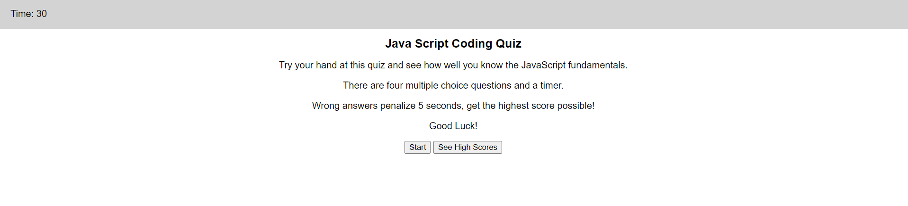

# Vince-s-JavaScript-Quiz
This Quiz will test your basic fundamentals of javascript

### Website Features:
1) Upon clicking the start button, a quiz with 4 questions will appear sequentially
2) Answering moves to the next question but wrong answers penalize 5 seconds
3) If you finish before the 30 sec timer runs out and place in the top 3, you will be able to store your score along with your name.
4) The high scores are stored to the local storage, so refreshing doesn't overwrite their values
5) You can view the high scores from the main menu or after taking the quiz

### What I learned from the creation of this site:
* Better understanding of calling & defining functions
* How to use local storage
* How to use JS to manipulate the webpage
* Better understanding of JSON and writing arrays to local storage
* How to set up a timer using setInterval
* Better understanding of event.target and how to pass events through a fuction

Try your hand at the Quiz at [Vincent D Momot's JS Quiz](https://vincentmomot.github.io/Vince-s-JavaScript-Quiz/index)

Screenshots of the site:
